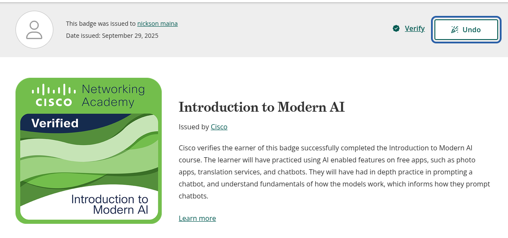

<h1 align="center">Hi, I'm Nickson 👋</h1>

Junior Developer • ICT Graduate • Cybersecurity & AI Learner

---

## 🚀 About Me
I'm a self-taught junior developer and ICT Graduate focused on building practical, automated solutions. I enjoy diving deep into system internals and exploring how AI can optimize workflows.

**Recent technical highlights:**
* 🛠️ **Server Management:** Deployed and maintained a home server to host self-hosted tools and local projects.
* 📧 **Automation:** Successfully cloned and configured an email automation repository, deploying it to my home server to handle scheduled communications.
* 🧠 **AI Integration:** Experimenting with LangGraph and Genkit to build intelligent decision-support systems for agriculture.

---

## 🎓 Education & Certifications
* **Diploma in Information Communication Technology (ICT)**
* **Intro to Modern AI** (Completed)
* **Build with AI (Unstacked Labs)** (Completed)

  
<b>View my Certificates 🏆</b>

   
  

    
    
  

---

## 🛠 Languages & Tools

  
  
  
  
  
  
  
  

---

## 📌 Projects

### 🔹 [AgriWealth-LangGraph-System](https://github.com/NickeyMaina/AgriWealth-LangGraph-System)
AI-based decision support system for livestock management using Python and LangGraph.

### 🔹 Farm Management System
A robust platform for managing farm resources and productivity tracking.
**Tech:** PHP, HTML, MySQL

### 🔹 Water Services Management System
A utility management tool designed for monitoring water distribution and billing.
**Tech:** PHP, HTML, CSS, MySQL

---

## 🌱 Currently Learning
- **Advanced Python** & Cybersecurity Fundamentals (TryHackMe/HTB)
- **AI Orchestration** (Vertex AI & Genkit)
- **Networking Basics** via home server experimentation

---

## 📫 Contact Me
- **Email:** mainanickson059@gmail.com

---

## ⚡ Fun Fact
💡 You can use AI as a co-pilot and be 100% productive or be its co-pilot and be 100% frustrated.  

“Code, Learn, Grow, Repeat.”

